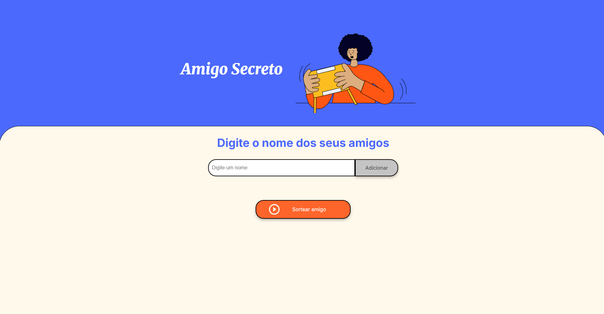

# 🎁 Amigo Secreto

Um simples aplicativo web para realizar sorteios de amigo secreto, onde os participantes podem ser adicionados a uma lista e um nome é sorteado aleatoriamente.

## 🚀 Tecnologias Utilizadas
- HTML5 → Estrutura da página
- CSS3 → Estilização do layout
- JavaScript → Lógica de adição e sorteio dos amigos

## 📌 Funcionalidades
* ✅ Adicionar amigos à lista
* ✅ Evitar nomes duplicados
* ✅ Sortear um amigo aleatoriamente
* ✅ Interface amigável

## 📂 Estrutura do Projeto
```bash
/amigo-secreto
│── index.html      # Página principal
│── app.js          # Lógica do sorteio e manipulação da lista
│── style.css       # Estilos da aplicação
│── assets/         # Imagens e ícones
└── README.md       # Documentação do projeto
```

## ⚡ Como Executar
Clone o repositório
sh
Copiar
Editar
git clone https://github.com/seu-usuario/amigo-secreto.git
Acesse a pasta do projeto
sh
Copiar
Editar
cd amigo-secreto
Abra o arquivo index.html em um navegador


## 🎮 Como Usar
* 1️⃣ Digite um nome no campo de entrada.
* 2️⃣ Clique no botão "Adicionar" para incluir na lista.
* 3️⃣ Após adicionar pelo menos dois amigos, clique em "Sortear amigo".
* 4️⃣ O nome do amigo sorteado será exibido na tela.

## 🖥️ Código Explicado
📌 app.js (Lógica do sorteio)
adicionarAmigo() → Adiciona um amigo à lista, impedindo nomes duplicados
exibirAmigos() → Atualiza a lista exibida na tela
sortearAmigo() → Sorteia um amigo aleatoriamente e exibe o resultado
javascript
Copiar
Editar
function sortearAmigo() {
    if (amigos.length < 2) {
        alert("Adicione pelo menos dois amigos para realizar o sorteio.");
        return;
    }

    const resultado = document.getElementById("resultado");
    resultado.innerHTML = "";
    
    let indice = Math.floor(Math.random() * amigos.length);
    let amigoSorteado = amigos[indice];

    const li = document.createElement("li");
    li.textContent = `Amigo secreto: ${amigoSorteado}`;
    resultado.appendChild(li);
}
📌 index.html (Estrutura da página)
Contém um campo de entrada para nomes
Lista dinâmica de amigos adicionados
Botão para sortear um amigo aleatoriamente
html
Copiar
Editar
<input type="text" id="amigo" class="input-name" placeholder="Digite um nome">
<button class="button-add" onclick="adicionarAmigo()">Adicionar</button>
<ul id="listaAmigos"></ul>
<button onclick="sortearAmigo()">Sortear amigo</button>
<ul id="resultado"></ul>

## 📜 Licença
Este projeto é livre para uso e modificação.


